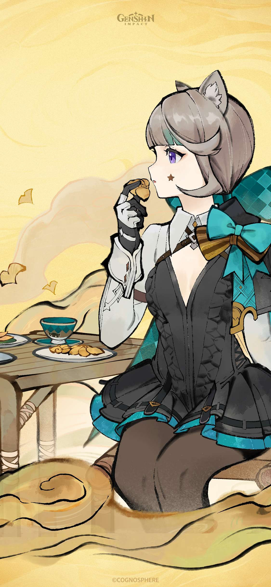

<kbd>
  
</kbd>

  
<pre>
    💼 Front-end & Back-end Developer
    💻 Web Technologies • Responsive Design
    📱 Progressive Web Apps • Single Page Applications
    🎮 Gaming Enthusiast • Anime Lover
    📚 Continuous Learning • Problem Solving
    🍰 Coding with Passion • Water Lover 💧
</pre>
  

   

<h3 align="left">Connect with me:</h3>

  

  

  

   
  
  
 

<h3 align="left">Languages and Tools:</h3>

  
  
  
  
  
  
  
  
  
  
  
  
  
  
  
  
  
  
  
  
  
  
  

&nbsp;

